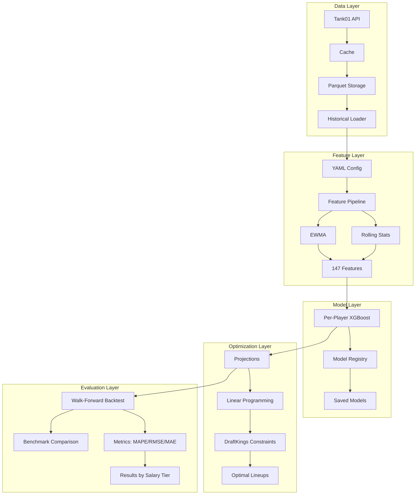

# NBA DFS ML Pipeline

Modular machine learning system for NBA DFS optimization on DraftKings with per-player XGBoost models.

## Architecture



### Design Philosophy

- **Modular**: Swap models, features, optimizers via configuration
- **Simple**: Explicit over implicit, readable over clever
- **Pluggable**: Registry pattern for components
- **Testable**: Clean interfaces, walk-forward validation
- **Reproducible**: YAML configuration tracking

### Project Structure

```
delapan-fantasy/
├── src/
│   ├── data/                 # Data layer
│   │   ├── collectors/       # API integrations
│   │   │   ├── tank01_client.py      # Tank01 RapidAPI client
│   │   │   ├── endpoints.py          # API endpoint definions
│   │   │   ├── local_data_client.py  # Local data access
│   │   │   └── cache.py              # API response caching
│   │   ├── storage/          # Storage backends
│   │   │   ├── base.py               # Abstract storage interface
│   │   │   ├── parquet_storage.py    # Parquet implementation
│   │   │   └── versioning.py         # Dataset versioning
│   │   └── loaders/          # Data loaders
│   │       ├── base.py               # Loader interface
│   │       └── historical_loader.py  # Historical data loader
│   ├── features/             # Feature engineering
│   │   ├── base.py           # FeatureTransformer interface
│   │   ├── registry.py       # Feature plugin system
│   │   ├── pipeline.py       # Sequential transformation pipeline
│   │   └── transformers/     # Feature implementations
│   │       ├── rolling_stats.py      # Rolling averages
│   │       └── ewma.py               # Exponential weighted MA
│   ├── models/               # ML models
│   │   ├── base.py           # BaseModel interface
│   │   ├── registry.py       # Model registry
│   │   ├── xgboost_model.py  # XGBoost implementation
│   │   └── random_forest_model.py    # Random Forest
│   ├── optimization/         # Lineup generation
│   │   ├── base.py           # Optimizer & Constraint initterfaces
│   │   ├── registry.py       # Optimizer registry
│   │   ├── constraints/      # Constraint implementations
│   │   │   └── draftkings.py         # DK rules
│   │   └── optimizers/       # Optimizer implementations
│   │       └── linear_program.py     # PuLP LP solver
│   ├── evaluation/           # Testing and validation
│   │   ├── backtest/         # Backtesting framework
│   │   │   └── validator.py          # Walk-forward validator
│   │   └── metrics/          # Performance metrics
│   │       ├── base.py               # Metric interface
│   │       ├── registry.py           # Metric registry
│   │       └── accuracy.py           # MAPE, RMSE, MAE, Correlation
│   ├── interface/            # Web interface
│   │   ├── __init__.py               # Interface module
│   │   ├── panel_backtest_app.py     # Panel backtest UI
│   │   └── assets/                   # UI assets (logos, styling)
│   ├── config/               # Configuration
│   │   └── paths.py          # Path management
│   └── utils/                # Utilities
│       ├── logging.py        # Logging configuration
│       ├── config_loader.py  # YAML config loader
│       ├── feature_config.py # Feature config loader
│       └── io.py             # I/O utilities
├── config/                   # Configuration files
│   ├── features/             # Feature configurations
│   │   ├── default_features.yaml    # Full feature set (21 stats)
│   │   └── base_features.yaml       # Minimal set (6 stats)
│   ├── models/               # Model configurations
│   └── experiments/          # Experiment configurations
├── scripts/                  # Data collection & processing scripts
│   ├── collect_games.py              # Collect schedules and box scores
│   ├── collect_dfs_salaries.py       # Collect DFS salaries
│   ├── load_games_to_db.py           # Load Parquet to SQLite
│   └── optimize_xgboost_hyperparameters.py  # Bayesian hyperparameter tuning
├── notebooks/                # Jupyter notebooks
│   ├── backtest_1d_by_player.ipynb   # Single-day per-player backtest
│   ├── backtest_1d_by_slate.ipynb    # Single-day slate-level backtest
│   ├── backtest_season.ipynb         # Season-long backtest
│   └── api_endpoint_exploration.ipynb
├── tests/                    # Unit tests
│   ├── data/                 # Data layer tests
│   │   ├── collectors/       # Collector tests
│   │   └── storage/          # Storage tests
│   └── features/             # Feature tests
└── requirements.txt
```

## Current Status

All five layers implemented with working end-to-end pipeline. Walk-forward backtesting framework operational with benchmark comparison.

### Data Layer
- Tank01 RapidAPI client with caching
- Parquet storage (date-partitioned)
- Historical data loader with temporal validation
- 3+ seasons of NBA data collected

### Feature Layer
- YAML-configured feature pipelines
- Rolling stats (3, 5, 10 game windows)
- EWMA transformers
- 147 features from 21 box score statistics

### Model Layer
- Per-player XGBoost models
- Bayesian hyperparameter optimization
- Model serialization with metadata
- Model recalibration logic (7-day default)
- 500+ player models trained per backtest
- Training inputs saved for reproducibility

### Optimization Layer
- Linear programming via PuLP
- DraftKings constraints (8 players, $50k salary cap)
- Multi-lineup generation

### Evaluation Layer
- Walk-forward backtesting framework (WalkForwardBacktest)
- Benchmark comparison (SeasonAverageBenchmark)
- Statistical significance testing (paired t-test, Cohen's d)
- MAPE, RMSE, MAE, Correlation metrics
- Error analysis by salary tier
- Feature importance tracking
- Predictions saved per slate with actuals

## Performance Benchmarks

### Walk-Forward Backtest (Multi-Slate)
- Framework: WalkForwardBacktest with recalibration every 7 days
- Benchmark: SeasonAverageBenchmark baseline comparison
- Statistical validation: Paired t-test, Cohen's d effect size
- Salary tier analysis: Performance breakdown by salary bins
- Model vs Benchmark: MAPE improvement tracking
- Coverage: 96%+ players per slate

### Single-Day Backtest (2025-02-05)
- Elite players ($8k+): 32.9% MAPE (target: 30%)
- High salary ($6-8k): 51.8% MAPE
- Mid salary ($4-6k): 76.8% MAPE
- Low salary ($0-4k): 103.6% MAPE
- Overall: 81.18% MAPE
- Correlation: 0.728
- Coverage: 96.4% (239/248 players)

Per-player models show strong correlation but struggle with low-output players. Elite tier meets target threshold. Walk-forward framework provides statistical validation against season average baseline.

## Key Design Patterns

### Configuration-Driven Features

YAML files define feature engineering pipelines:

```python
from src.utils.feature_config import load_feature_config

feature_config = load_feature_config('default_features')
pipeline = feature_config.build_pipeline(FeaturePipeline)
features = pipeline.fit_transform(training_data)
```

Configuration files in [config/features/](config/features/):
- default_features.yaml: 21 statistics, 147 features
- base_features.yaml: 6 core statistics for rapid experimentation

### Registry Pattern

Hot-swap components via registries:

```python
from src.models.registry import ModelRegistry
from src.features.registry import FeatureRegistry
from src.optimization.registry import OptimizerRegistry

model = ModelRegistry.create('xgboost', config)
feature = FeatureRegistry.create('rolling_stats', windows=[3,5,10])
optimizer = OptimizerRegistry.create('linear_program', constraints)
```

### Per-Player Training

Individual models capture player-specific patterns:

```python
from src.data.loaders.historical_loader import HistoricalDataLoader

loader = HistoricalDataLoader(storage)
for player_id in slate_players:
    player_data = loader.load_player_historical(player_id, lookback_days=365)
    model = XGBoostModel(config)
    model.train(player_data[features], player_data['fpts'])
    model.save(f'models/{date}/{player_name}_{player_id}.pkl')
```

## Deployment Options

### Architecture Choices

Two deployment architectures supported:

1. **Integrated Architecture** (default): Code and data in same directory
2. **Separated Architecture**: Code and data in different locations

**Integrated:**
```
delapan-fantasy/
  ├── src/
  ├── data/
  └── nba_dfs.db
```

**Separated:**
```
C:\Code\delapan-fantasy\    # Code (from git)
D:\NBA_Data\                # Data (persistent)
  ├── nba_dfs.db
  ├── data/
  └── models/
```

### Deployment Guides

- **[docs/LOCAL_SEPARATED_SETUP.md](docs/LOCAL_SEPARATED_SETUP.md)** - Local separated architecture setup
- **[docs/COLAB_SETUP.md](docs/COLAB_SETUP.md)** - Google Colab cloud training
- **[docs/GPU_TRAINING.md](docs/GPU_TRAINING.md)** - GPU-accelerated training guide

**Separated architecture benefits:**
- Clean git repository (no large data files)
- Flexible storage options (different drives)
- Easy backup strategies
- Share data across code branches
- Improved portability

**Cloud training options:**
- Google Colab Free: $0/month, 2 cores, 12GB RAM, ~21 min/slate
- Google Colab Pro: $10/month, 4 cores, 25GB RAM, ~10.4 min/slate (recommended)
- Google Colab Pro+: $50/month, 8 cores, 50GB RAM, ~5.2 min/slate
- GPU instances (A100/V100): 5-10x speedup, ~3-5 min/slate for per-player models

## Quick Start

### Installation

```bash
pip install -r requirements.txt
```

### Configuration

Create .env file with Tank01 API key:

```bash
TANK01_API_KEY=your_rapidapi_key_here
```

Get API key from RapidAPI Tank01 Fantasy Stats subscription.

### Data Collection

Collect historical game data:

```bash
python scripts/collect_games.py --start-date 20241201 --end-date 20241231
```

Collect DFS salaries:

```bash
python scripts/collect_dfs_salaries.py --start-date 20241201 --end-date 20241231
```

See [scripts/README.md](scripts/README.md) for detailed documentation.

### Testing

```bash
pytest tests/
pytest tests/data/ -v
```

### Running Backtests

Choose from three execution options:

**Command-line (fastest for batch processing):**
```bash
python scripts/run_backtest.py --test-start 20250205 --test-end 20250206 --per-player
```

**Interactive Panel UI (recommended for exploration):**
```bash
panel serve src/interface/panel_backtest_app.py --show
```
Opens dashboard at http://localhost:5006 with real-time results and configuration controls.

**Interactive Streamlit UI (alternative):**
```bash
streamlit run src/interface/backtest_app.py
```
Opens dashboard at http://localhost:8501 with interactive controls.

See [docs/PANEL_INTERFACE.md](docs/PANEL_INTERFACE.md) for Panel UI detailed guide.

## API Rate Limits

Tank01 RapidAPI limits:
- 1000 requests/month (free tier)
- Client tracks usage via request_count
- Estimate: 1 request per date + 1 per game (11 games/day average = 12 requests/day)

## Dependencies

```
pandas>=2.0.0
numpy>=1.24.0
requests>=2.31.0
python-dotenv>=1.0.0
pyyaml>=6.0.0
pyarrow>=19.0.0
scikit-learn>=1.3.0
xgboost>=2.0.0
lightgbm>=4.0.0
PuLP>=2.7.0
pytest>=7.4.0
pytest-cov>=4.1.0
```

## Success Criteria

- **Model Performance**: ~30% MAPE on player projections
- **Optimization Speed**: Valid DK lineups in <1 second
- **Modularity**: Clean model/feature/optimizer swapping
- **Validation**: Walk-forward framework functional
- **Code Quality**: Unit tests, type hints, documentation

## Research Foundation

Based on academic research:

- **Papageorgiou et al. (2024)**: Individual player models, 28-30% MAPE
- **Hunter, Vielma & Zaman**: Linear programming optimization
- **Wang et al. (2024)**: XGBoost + SHAP interpretability

Key insights:

- Individual per-player models > aggregate approaches (+1.7-2.1%)
- Ensemble ML (XGBoost + RF) > single algorithms
- Linear programming optimal for single lineups
- Genetic algorithms for multi-lineup portfolios
- Fractional Kelly (1/3) for bankroll management

## Current Usage

### Data Collection Example

```python
from src.data.collectors.tank01_client import Tank01Client
from src.data.storage.csv_storage import CSVStorage

client = Tank01Client()
storage = CSVStorage()

date = '20241215'
salaries = client.get_dfs_salaries(date)
storage.save_dfs_salaries(salaries, date)

schedule = client.get_schedule(date)
storage.save_schedule(schedule, date)

odds = client.get_betting_odds(date)
storage.save_betting_odds(odds, date)
```

### Data Loading

```python
from src.data.storage.csv_storage import CSVStorage

storage = CSVStorage()

df = storage.load_data(
    'dfs_salaries',
    start_date='20241201',
    end_date='20241231'
)
```

### Historical Data Collection

```bash
python scripts/build_historical_game_logs.py
```

Edit script to configure date range before running.

### Architecture

**BacktestRunner (Background Worker)**
- Executes WalkForwardBacktest in daemon thread
- Thread-safe queues (log_queue, result_queue) for non-blocking streaming
- Captures stdout/stderr and logging handlers
- Graceful error handling with optional error message

**Session State Management**
- backtest_config: Current configuration dictionary
- logs: Streamed log entries with timestamps
- daily_results: Per-slate results as they complete
- final_summary: Aggregated backtest statistics
- runner: Active BacktestRunner instance
- training_sample: Cached feature matrix preview

**Event Loop**
- Polls runner queues every second (non-blocking get_nowait())
- Routes events to appropriate state containers
- Auto-reruns UI while backtest is running
- Displays error message if execution fails

### Experiment Configuration

Create YAML files in `config/experiments/` to define presets:

```yaml
data:
  train_start: "20241001"
  train_end: "20241130"
  test_start: "20241201"
  test_end: "20241215"

model:
  type: xgboost
  params:
    max_depth: 8
    learning_rate: 0.05
    n_estimators: 300
    min_child_weight: 5

evaluation:
  output_dir: data/backtest_results
```

Select preset from sidebar dropdown to populate all fields automatically.

### Training Sample Preview

Inspect engineered features before full backtest:

1. Click "Load sample" button
2. Adjust row limit slider (5-200 rows)
3. View DataFrame with columns: playerID, playerName, team, pos, gameDate, target, [features...]
4. Sample cached until configuration changes

Rebuilds feature matrix using same pipeline as backtest training phase.

### Differences from Script-Based Backtesting

| Aspect | Script (CLI) | Streamlit (UI) |
|--------|-------------|----------------|
| Configuration | Command-line arguments | Interactive form controls |
| Execution | Synchronous (blocks terminal) | Asynchronous (background daemon) |
| Progress Monitoring | Console output | Real-time streamed panel |
| Feature Inspection | Separate notebook/script | Integrated "Training Input Sample" tab |
| Experimentation | Edit code/configs, re-run | Change UI values, click Run |
| Error Handling | Exception traceback in terminal | Error message in UI panel |
| Results Access | File system only | Streamed to UI + file system |

### Requirements

- Streamlit >= 1.28.0
- SQLite database with collected game/salary data (scripts/collect_games.py, scripts/collect_dfs_salaries.py)
- YAML configuration files in config/experiments/ (optional but recommended)

### Troubleshooting

**Backtest never starts:**
- Verify SQLite database exists at specified path
- Check database contains data for training date range
- Ensure feature config file exists (config/features/default_features.yaml)

**Empty training sample:**
- Confirm training date range has available player game logs
- Verify feature pipeline completes without errors
- Check minutes_threshold isn't filtering all players


## Notebooks

### backtest_1d_by_player.ipynb
Per-player model training and evaluation for single date. Demonstrates:
- Historical data loading with temporal validation
- YAML-configured feature pipeline
- Per-player XGBoost training
- Bayesian hyperparameter optimization
- Error analysis by salary tier

### backtest_1d_by_slate.ipynb
Slate-level model (single model for all players) for comparison baseline.

### backtest_season.ipynb
Season-long walk-forward backtesting across multiple dates using WalkForwardBacktest framework:
- Automated model recalibration
- Benchmark comparison with season average baseline
- Statistical significance testing
- Salary tier performance analysis
- Model and prediction persistence

### benchmark_comparison.ipynb
Comparative analysis between ML models and season average benchmark:
- Head-to-head performance comparison
- Statistical significance testing (paired t-test)
- Effect size calculation (Cohen's d)
- Salary tier breakdown

## Identified Issues and Roadmap

### Critical Issues
1. Low-output player MAPE inflation (103.6% for $0-4k tier)
2. Missing injury/inactive status filtering
3. No contextual features (home/away, rest days, matchups)
4. Variance prediction failure (hot streaks, cold streaks)

### Immediate Priority
1. Add injury/inactive filtering before prediction
2. Implement starter/bench role indicators
3. Add home/away and rest day features
4. Multi-day backtesting for validation

### Future Enhancements
- Opponent defensive rating features
- Minutes projection model
- Ensemble methods (XGBoost + Random Forest)
- Quantile regression for confidence intervals
- GPP optimizer with genetic algorithms
- Exposure management for multi-lineup generation

## License

MIT
