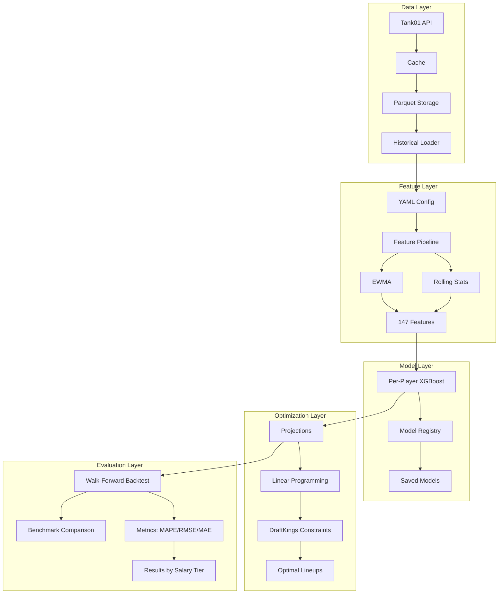

# NBA DFS ML Pipeline

Modular machine learning system for NBA DFS optimization on DraftKings with per-player XGBoost models.

## Architecture
```mermaid
graph TD
      A["CLI Arguments<br/>--test-start, --test-end<br/>--model-type,
  --per-player<br/>--contest-config, etc."] --> B["Parse Arguments"]

      B --> C["Determine Training Period<br/>train_start → train_end"]

      D["Model Config YAML<br/>hyperparameters"] --> E["Load
  Model<br/>Configuration"]

      F["Contest Config JSON<br/>salary cap, roster<br/>construction"]
  --> G["Load Contest<br/>Configuration"]

      H["Player Filters<br/>salary, injury,<br/>IDs, names, CSV"] -->
  I["Build Filter<br/>Pipeline"]

      C --> J["HistoricalDataLoader<br/>get_season_start_date"]
      J --> K["Load Training Data<br/>train_start:train_end"]
      K --> L["Load Test Data<br/>test_start:test_end"]

      E --> M["BacktestWithLineups<br/>Initialization"]
      G --> M
      I --> M
      L --> M

      M --> N["Feature Engineering<br/>feature_config"]
      N --> O["Train Models<br/>per-player or slate-level"]

      O --> P["Walk-Forward<br/>Backtesting Loop"]

      P --> Q["Generate Predictions<br/>test slate date"]
      Q --> R["Apply Player Filters<br/>salary, injuries,<br/>custom
  filters"]

      R --> S["Lineup Optimization<br/>pydfs-lineup-optimizer"]
      S --> T["Generate N Lineups<br/>num_lineups parameter"]

      T --> U["Score Lineups<br/>vs Actual Results"]
      U --> V["Track Performance<br/>correlation, error %"]

      V --> W["Recalibrate Model?<br/>recalibrate_days"]
      W -->|Yes| O
      W -->|No| X{More Test<br/>Slates?}

      X -->|Yes| Q
      X -->|No| Y["Aggregate Results"]

      Y --> Z["Save Outputs"]

      Z --> Z1["CSV Lineups<br/>DraftKings format"]
      Z --> Z2["JSON Lineups<br/>Full details"]
      Z --> Z3["Performance Report<br/>metrics & analysis"]
      Z --> Z4["Saved Models<br/>pkl format"]
      Z --> Z5["Predictions<br/>parquet files"]

      Z1 --> AA["Output Directory<br/>data/backtest_results"]
      Z2 --> AA
      Z3 --> AA
      Z4 --> AA
      Z5 --> AA

      AA --> AB["Summary Report<br/>test_slates<br/>total_players<br/>avg
  _correlation<br/>avg_error_pct"]

      style A fill:#e1f5ff
      style D fill:#e1f5ff
      style F fill:#e1f5ff
      style H fill:#e1f5ff
      style K fill:#fff3e0
      style L fill:#fff3e0
      style O fill:#f3e5f5
      style Q fill:#f3e5f5
      style T fill:#e8f5e9
      style U fill:#e8f5e9
      style AA fill:#fce4ec
      style AB fill:#fce4ec

    end
```



```mermaid
graph TB
    subgraph "Data Layer"
        A[Tank01 API] --> B[Cache]
        B --> C[Parquet Storage]
        C --> D[Historical Loader]
    end

    subgraph "Feature Layer"
        D --> E[YAML Config]
        E --> F[Feature Pipeline]
        F --> G[Rolling Stats]
        F --> H[EWMA]
        G --> I[147 Features]
        H --> I
    end

    subgraph "Model Layer"
        I --> J[Per-Player XGBoost]
        J --> K[Model Registry]
        K --> L[Saved Models]
    end

    subgraph "Optimization Layer"
        J --> M[Projections]
        M --> N[Linear Programming]
        N --> O[DraftKings Constraints]
        O --> P[Optimal Lineups]
    end

    subgraph "Evaluation Layer"
        M --> Q[Walk-Forward Backtest]
        Q --> R[Metrics: MAPE/RMSE/MAE]
        Q --> S[Benchmark Comparison]
        R --> T[Results by Salary Tier]
    end
```

### Design Philosophy

- **Modular**: Swap models, features, optimizers via configuration
- **Simple**: Explicit over implicit, readable over clever
- **Pluggable**: Registry pattern for components
- **Testable**: Clean interfaces, walk-forward validation
- **Reproducible**: YAML configuration tracking

### Project Structure

```
delapan-fantasy/
├── src/
│   ├── data/                 # Data layer
│   │   ├── collectors/       # API integrations
│   │   │   ├── tank01_client.py      # Tank01 RapidAPI client
│   │   │   ├── endpoints.py          # API endpoint definions
│   │   │   ├── local_data_client.py  # Local data access
│   │   │   └── cache.py              # API response caching
│   │   ├── storage/          # Storage backends
│   │   │   ├── base.py               # Abstract storage interface
│   │   │   ├── parquet_storage.py    # Parquet implementation
│   │   │   └── versioning.py         # Dataset versioning
│   │   └── loaders/          # Data loaders
│   │       ├── base.py               # Loader interface
│   │       └── historical_loader.py  # Historical data loader
│   ├── features/             # Feature engineering
│   │   ├── base.py           # FeatureTransformer interface
│   │   ├── registry.py       # Feature plugin system
│   │   ├── pipeline.py       # Sequential transformation pipeline
│   │   └── transformers/     # Feature implementations
│   │       ├── rolling_stats.py      # Rolling averages
│   │       └── ewma.py               # Exponential weighted MA
│   ├── models/               # ML models
│   │   ├── base.py           # BaseModel interface
│   │   ├── registry.py       # Model registry
│   │   ├── xgboost_model.py  # XGBoost implementation
│   │   └── random_forest_model.py    # Random Forest
│   ├── optimization/         # Lineup generation
│   │   ├── base.py           # Optimizer & Constraint initterfaces
│   │   ├── registry.py       # Optimizer registry
│   │   ├── constraints/      # Constraint implementations
│   │   │   └── draftkings.py         # DK rules
│   │   └── optimizers/       # Optimizer implementations
│   │       └── linear_program.py     # PuLP LP solver
│   ├── evaluation/           # Testing and validation
│   │   ├── backtest/         # Backtesting framework
│   │   │   └── validator.py          # Walk-forward validator
│   │   └── metrics/          # Performance metrics
│   │       ├── base.py               # Metric interface
│   │       ├── registry.py           # Metric registry
│   │       └── accuracy.py           # MAPE, RMSE, MAE, Correlation
│   ├── interface/            # Web interface
│   │   ├── __init__.py               # Interface module
│   │   ├── panel_backtest_app.py     # Panel backtest UI
│   │   └── assets/                   # UI assets (logos, styling)
│   ├── config/               # Configuration
│   │   └── paths.py          # Path management
│   └── utils/                # Utilities
│       ├── logging.py        # Logging configuration
│       ├── config_loader.py  # YAML config loader
│       ├── feature_config.py # Feature config loader
│       └── io.py             # I/O utilities
├── config/                   # Configuration files
│   ├── features/             # Feature configurations
│   │   ├── default_features.yaml    # Full feature set (21 stats)
│   │   └── base_features.yaml       # Minimal set (6 stats)
│   ├── models/               # Model configurations
│   └── experiments/          # Experiment configurations
├── scripts/                  # Data collection & processing scripts
│   ├── collect_games.py              # Collect schedules and box scores
│   ├── collect_dfs_salaries.py       # Collect DFS salaries
│   ├── run_backtest.py               # Run walk-forward backtest
│   └── optimize_hyperparameters.py   # Bayesian hyperparameter tuning
├── notebooks/                # Jupyter notebooks
│   ├── backtest_1d_by_player.ipynb   # Single-day per-player backtest
│   ├── backtest_1d_by_slate.ipynb    # Single-day slate-level backtest
│   ├── backtest_season.ipynb         # Season-long backtest
│   └── api_endpoint_exploration.ipynb
├── tests/                    # Unit tests
│   ├── data/                 # Data layer tests
│   │   ├── collectors/       # Collector tests
│   │   └── storage/          # Storage tests
│   └── features/             # Feature tests
└── requirements.txt
```

## Current Status

All five layers implemented with production-ready daily DFS workflow. Modular slate prediction and lineup optimization via command-line scripts.

### Data Layer
- Tank01 RapidAPI client with caching
- Parquet storage (date-partitioned)
- Historical data loader with temporal validation
- 3+ seasons of NBA data collected

### Feature Layer
- YAML-configured feature pipelines
- Rolling stats (3, 5, 10 game windows) with EWMA transformers
- NEW: Advanced efficiency metrics (eFG%, TS%, FTR, GameScore, AST/TO ratio)
- 147+ features from 21 box score statistics + efficiency metrics

### Model Layer
- Per-player XGBoost models (primary)
- Random Forest baseline
- NEW: Ensemble models (Stacking, Bagging)
- Model registry for hot-swapping
- Model serialization with metadata

### Optimization Layer
- Linear programming via PuLP
- pydfs-lineup-optimizer integration
- DraftKings constraints (8 players, $50k salary cap)
- Multi-lineup generation with exposure management

### Evaluation Layer
- Position and salary tier performance analysis
- MAPE cross-tabulation (salary × position)
- Segmented metrics (analyze_by_salary, analyze_by_position)
- MAPE, RMSE, MAE, Correlation metrics
- Integrated into predict_slate.py via --analyze flag

## Performance Benchmarks

### Phase 2 Validation (2025-02-05) - Full Slate
- Players predicted: 241/248 (97.2% coverage)
- Overall: 58.2% MAPE, 0.683 correlation
- Elite players ($8k+): 33.7% MAPE (near 30% target)
- Best tier: $9k+ at 30.4% MAPE
- Best position: Centers at 58.2% MAPE

### Salary Tier Breakdown
- $9k+: 30.4% MAPE (11 players) ✓ Target met
- $7-9k: 37.3% MAPE (23 players)
- $5-7k: 61.9% MAPE (44 players)
- $3-5k: 114.7% MAPE (163 players) - High variance in low-output players

### Position Performance
- Centers (C): 58.2% MAPE (35 players)
- Power Forwards (PF): 62.7% MAPE (43 players)
- Point Guards (PG): 63.9% MAPE (45 players)
- Small Forwards (SF): 84.9% MAPE (53 players)
- Shooting Guards (SG): 161.5% MAPE (65 players) - Needs improvement

### Best Segments (Salary × Position)
- $7-9k PF: 13.4% MAPE (5 players)
- $9k+ C: 17.7% MAPE (3 players)
- $7-9k PG: 19.6% MAPE (9 players)

## Key Design Patterns

### Configuration-Driven Features

YAML files define feature engineering pipelines:

```python
from src.utils.feature_config import load_feature_config

feature_config = load_feature_config('default_features')
pipeline = feature_config.build_pipeline(FeaturePipeline)
features = pipeline.fit_transform(training_data)
```

Configuration files in [config/features/](config/features/):
- default_features.yaml: 21 statistics, 147 features
- base_features.yaml: 6 core statistics for rapid experimentation

### Registry Pattern

Hot-swap components via registries:

```python
from src.models.registry import ModelRegistry
from src.features.registry import FeatureRegistry
from src.optimization.registry import OptimizerRegistry

model = ModelRegistry.create('xgboost', config)
feature = FeatureRegistry.create('rolling_stats', windows=[3,5,10])
optimizer = OptimizerRegistry.create('linear_program', constraints)
```

### Per-Player Training

Individual models capture player-specific patterns:

```python
from src.data.loaders.historical_loader import HistoricalDataLoader

loader = HistoricalDataLoader(storage)
for player_id in slate_players:
    player_data = loader.load_player_historical(player_id, lookback_days=365)
    model = XGBoostModel(config)
    model.train(player_data[features], player_data['fpts'])
    model.save(f'models/{date}/{player_name}_{player_id}.pkl')
```

## Deployment Options

### Architecture Choices

Two deployment architectures supported:

1. **Integrated Architecture** (default): Code and data in same directory
2. **Separated Architecture**: Code and data in different locations

**Integrated:**
```
delapan-fantasy/
  ├── src/
  ├── data/
  └── nba_dfs.db
```

**Separated:**
```
C:\Code\delapan-fantasy\    # Code (from git)
D:\NBA_Data\                # Data (persistent)
  ├── nba_dfs.db
  ├── data/
  └── models/
```

### Deployment Guides

- **[docs/LOCAL_SEPARATED_SETUP.md](docs/LOCAL_SEPARATED_SETUP.md)** - Local separated architecture setup
- **[docs/COLAB_SETUP.md](docs/COLAB_SETUP.md)** - Google Colab cloud training
- **[docs/GPU_TRAINING.md](docs/GPU_TRAINING.md)** - GPU-accelerated training guide

**Separated architecture benefits:**
- Clean git repository (no large data files)
- Flexible storage options (different drives)
- Easy backup strategies
- Share data across code branches
- Improved portability

**Cloud training options:**
- Google Colab Free: $0/month, 2 cores, 12GB RAM, ~21 min/slate
- Google Colab Pro: $10/month, 4 cores, 25GB RAM, ~10.4 min/slate (recommended)
- Google Colab Pro+: $50/month, 8 cores, 50GB RAM, ~5.2 min/slate
- GPU instances (A100/V100): 5-10x speedup, ~3-5 min/slate for per-player models

## Quick Start

### Installation

```bash
pip install -r requirements.txt
```

### Configuration

Create .env file with Tank01 API key:

```bash
TANK01_API_KEY=your_rapidapi_key_here
```

Get API key from RapidAPI Tank01 Fantasy Stats subscription.

### Data Collection

Collect historical game data:

```bash
python scripts/collect_games.py --start-date 20241201 --end-date 20241231
```

Collect DFS salaries:

```bash
python scripts/collect_dfs_salaries.py --start-date 20241201 --end-date 20241231
```

See [scripts/README.md](scripts/README.md) for detailed documentation.

### Testing

```bash
pytest tests/
pytest tests/data/ -v
```

### Daily DFS Workflow

**Step 1: Generate Predictions**
```bash
# Basic prediction for a slate
python scripts/predict_slate.py --date 20250210

# With performance analysis
python scripts/predict_slate.py --date 20250210 --analyze

# Swap feature sets or models
python scripts/predict_slate.py --date 20250210 --features default_features --model stacked_xgb_rf
```

**Step 2: Generate Lineups**
```bash
# Single lineup (cash game)
python scripts/generate_lineups.py --predictions predictions.csv --num-lineups 1

# Multiple lineups (GPP tournament)
python scripts/generate_lineups.py --predictions predictions.csv --num-lineups 20 --strategy aggressive
```

**Step 3: Upload to DraftKings**
- Lineups exported to CSV in DraftKings format
- Ready for direct upload to contests

### Walk-Forward Backtest Simulation

Validate production pipeline on historical data:

```bash
# Run simulation across date range
python scripts/run_walk_forward_backtest.py --start-date 20250201 --end-date 20250210

# With multiple lineups and custom configuration
python scripts/run_walk_forward_backtest.py \
  --start-date 20250201 \
  --end-date 20250210 \
  --num-lineups 20 \
  --features default_features \
  --model stacked_xgb_rf \
  --strategy aggressive \
  --save-predictions \
  --save-lineups

# Generate comprehensive report with visualizations
python -m src.evaluation.backtest_report \
  --results data/backtest_results/simulation_results_TIMESTAMP.json \
  --output-dir data/backtest_results/report
```

**What it does:**
- Loops through each slate date in the range
- Generates predictions and lineups for each day
- Scores lineups against actual results
- Reports aggregate performance metrics
- Creates visualizations (daily performance, error distribution, bias analysis)

### Development Notebooks

**Phase 1: Single Player Validation** (`notebooks/01_single_day_foundation.ipynb`)
- Validates data loading, feature engineering, model training on single player
- Demonstrates temporal validation and no-lookahead bias
- MAPE calculation and feature importance analysis

**Phase 2: Full Slate Prediction** (`notebooks/02_full_slate_prediction.ipynb`)
- Scales to all players on a slate (241 players)
- Per-player model training with XGBoost
- Position and salary tier performance analysis
- MAPE cross-tabulation (salary × position)
- Visualization: scatter plots, heatmaps, error distributions

**Legacy Notebooks** (moved to `notebooks/deprecated/`)
- Old backtesting execution notebooks
- Replaced by modular scripts workflow

## API Rate Limits

Tank01 RapidAPI limits:
- 1000 requests/month (free tier)
- Client tracks usage via request_count
- Estimate: 1 request per date + 1 per game (11 games/day average = 12 requests/day)

## Dependencies

```
pandas>=2.0.0
numpy>=1.24.0
requests>=2.31.0
python-dotenv>=1.0.0
pyyaml>=6.0.0
pyarrow>=19.0.0
scikit-learn>=1.3.0
xgboost>=2.0.0
lightgbm>=4.0.0
PuLP>=2.7.0
pytest>=7.4.0
pytest-cov>=4.1.0
```

## Success Criteria

- **Model Performance**: ~30% MAPE on player projections
- **Optimization Speed**: Valid DK lineups in <1 second
- **Modularity**: Clean model/feature/optimizer swapping
- **Validation**: Walk-forward framework functional
- **Code Quality**: Unit tests, type hints, documentation

## Research Foundation

Based on academic research:

- **Papageorgiou et al. (2024)**: Individual player models, 28-30% MAPE
- **Hunter, Vielma & Zaman**: Linear programming optimization
- **Wang et al. (2024)**: XGBoost + SHAP interpretability

Key insights:

- Individual per-player models > aggregate approaches (+1.7-2.1%)
- Ensemble ML (XGBoost + RF) > single algorithms
- Linear programming optimal for single lineups
- Genetic algorithms for multi-lineup portfolios
- Fractional Kelly (1/3) for bankroll management

## Current Usage

### Data Collection Example

```python
from src.data.collectors.tank01_client import Tank01Client
from src.data.storage.csv_storage import CSVStorage

client = Tank01Client()
storage = CSVStorage()

date = '20241215'
salaries = client.get_dfs_salaries(date)
storage.save_dfs_salaries(salaries, date)

schedule = client.get_schedule(date)
storage.save_schedule(schedule, date)

odds = client.get_betting_odds(date)
storage.save_betting_odds(odds, date)
```

### Data Loading

```python
from src.data.storage.csv_storage import CSVStorage

storage = CSVStorage()

df = storage.load_data(
    'dfs_salaries',
    start_date='20241201',
    end_date='20241231'
)
```

### Historical Data Collection

```bash
python scripts/build_historical_game_logs.py
```

Edit script to configure date range before running.

### Architecture

**BacktestRunner (Background Worker)**
- Executes WalkForwardBacktest in daemon thread
- Thread-safe queues (log_queue, result_queue) for non-blocking streaming
- Captures stdout/stderr and logging handlers
- Graceful error handling with optional error message

**Session State Management**
- backtest_config: Current configuration dictionary
- logs: Streamed log entries with timestamps
- daily_results: Per-slate results as they complete
- final_summary: Aggregated backtest statistics
- runner: Active BacktestRunner instance
- training_sample: Cached feature matrix preview

**Event Loop**
- Polls runner queues every second (non-blocking get_nowait())
- Routes events to appropriate state containers
- Auto-reruns UI while backtest is running
- Displays error message if execution fails

### Experiment Configuration

Create YAML files in `config/experiments/` to define presets:

```yaml
data:
  train_start: "20241001"
  train_end: "20241130"
  test_start: "20241201"
  test_end: "20241215"

model:
  type: xgboost
  params:
    max_depth: 8
    learning_rate: 0.05
    n_estimators: 300
    min_child_weight: 5

evaluation:
  output_dir: data/backtest_results
```

Select preset from sidebar dropdown to populate all fields automatically.

### Training Sample Preview

Inspect engineered features before full backtest:

1. Click "Load sample" button
2. Adjust row limit slider (5-200 rows)
3. View DataFrame with columns: playerID, playerName, team, pos, gameDate, target, [features...]
4. Sample cached until configuration changes

Rebuilds feature matrix using same pipeline as backtest training phase.

### Differences from Script-Based Backtesting

| Aspect | Script (CLI) | Streamlit (UI) |
|--------|-------------|----------------|
| Configuration | Command-line arguments | Interactive form controls |
| Execution | Synchronous (blocks terminal) | Asynchronous (background daemon) |
| Progress Monitoring | Console output | Real-time streamed panel |
| Feature Inspection | Separate notebook/script | Integrated "Training Input Sample" tab |
| Experimentation | Edit code/configs, re-run | Change UI values, click Run |
| Error Handling | Exception traceback in terminal | Error message in UI panel |
| Results Access | File system only | Streamed to UI + file system |

### Requirements

- Panel >= 1.3.0 (for UI)
- Parquet data files with collected game/salary data (scripts/collect_games.py, scripts/collect_dfs_salaries.py)
- YAML configuration files in config/experiments/ (optional but recommended)

### Troubleshooting

**Backtest never starts:**
- Verify parquet data files exist in data directory
- Check data directory contains files for training date range
- Ensure feature config file exists (config/features/default_features.yaml)

**Empty training sample:**
- Confirm training date range has available player game logs
- Verify feature pipeline completes without errors
- Check minutes_threshold isn't filtering all players


## New Features (2025-10-26)

### Advanced Efficiency Metrics
Three new transformer classes for NBA advanced metrics:

**EfficiencyMetricsTransformer:**
- eFG% (Effective Field Goal %)
- TS% (True Shooting %)
- FTR (Free Throw Rate)
- TotalReb (Offensive + Defensive rebounds)

**PlaymakingMetricsTransformer:**
- AST_TO_ratio (Assists per turnover)

**ImpactMetricsTransformer:**
- GameScore (Hollinger's composite metric)

These metrics are included in rolling stats and EWMA calculations, creating temporal patterns for improved predictions.

### Ensemble Models
**Stacking:** Combines XGBoost + Random Forest base models with XGBoost meta-learner (`config/models/stacked_xgb_rf.yaml`)

**Bagging:** Bootstrap aggregating with 10 XGBoost models for variance reduction (`config/models/bagged_xgboost.yaml`)

### Production Scripts
**predict_slate.py:** Modular slate prediction with swappable features/models
**generate_lineups.py:** Lineup optimization via pydfs-lineup-optimizer

### Position Analysis
Cross-tabulation of MAPE by salary tier × position for granular performance insights

## Roadmap

### Completed (2025-10-26)
✓ Advanced efficiency metrics (eFG%, TS%, GameScore, etc.)
✓ Ensemble models (Stacking, Bagging)
✓ Position-based performance analysis
✓ Modular production scripts (predict_slate.py, generate_lineups.py)
✓ Codebase consolidation (deprecated legacy infrastructure)
✓ **Walk-forward backtest simulation:** Multi-day framework that iterates through historical slates, simulating the daily workflow (predict → optimize → score) to validate production pipeline performance

### In Progress
- Contextual features (home/away, rest days, back-to-back games)
- Shooting guard (SG) position performance improvement

### Planned
- Opponent defensive rating features
- Minutes projection model
- Injury/inactive status integration
- Starter/bench role indicators
- Variance prediction (confidence intervals)
- GPP-specific optimizer with genetic algorithms

## License

MIT
