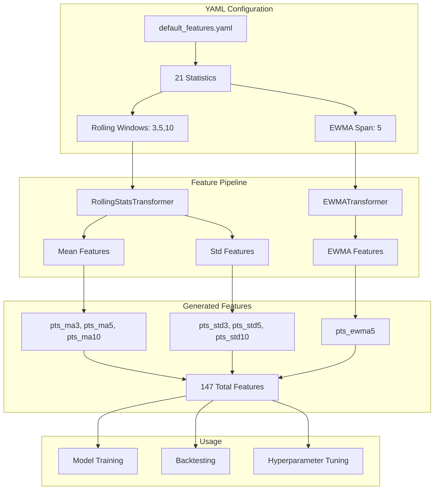

# Feature Configuration Integration

YAML-based feature configuration system for reproducible feature engineering.

## Feature Pipeline Architecture



## Overview

Feature configurations are centralized in YAML files (config/features/) instead of hardcoded in notebooks. Benefits:

- Single source of truth for feature engineering
- Rapid experimentation with different feature sets
- Full reproducibility across runs
- Version control for feature evolution
- Configuration tracking in results

## Configuration Files

Location: `config/features/`

### Available Configs

#### `default_features.yaml`
Full feature set with all 21 statistics:
- All box score stats (pts, reb, ast, stl, blk, TOV, PF, etc.)
- Shooting percentages (fgp, ftp, tptfgp)
- Advanced stats (usage, plusMinus, OffReb, DefReb)
- Rolling windows: [3, 5, 10]
- EWMA span: 5
- Include standard deviations: True

**Use for**: Production models, maximum information capture

#### `base_features.yaml`
Minimal feature set with 6 core statistics:
- Basic box score only (pts, reb, ast, stl, blk, mins)
- Rolling windows: [3, 5, 10]
- EWMA span: 5
- Include standard deviations: True

**Use for**: Quick experimentation, faster training

## Configuration Structure

```yaml
name: "Feature Set Name"
description: "Description of what this config does"
version: "2.0.0"

# Statistics to include in features
stats:
  - pts
  - reb
  - ast
  # ... more stats

# Rolling window sizes
rolling_windows: [3, 5, 10]

# EWMA span parameter
ewma_span: 5

# Transformer pipeline
transformers:
  - type: rolling_stats
    params:
      windows: [3, 5, 10]
      include_std: true

  - type: ewma
    params:
      span: 5
```

## Usage

### In Notebooks

```python
from src.utils.feature_config import load_feature_config

# Load configuration
feature_config = load_feature_config('default_features')

# Print config info
print(f"Feature Config: {feature_config.name}")
print(f"Stats: {len(feature_config.stats)} features")
print(f"Rolling windows: {feature_config.rolling_windows}")

# Build pipeline from config
from src.features.pipeline import FeaturePipeline
pipeline = feature_config.build_pipeline(FeaturePipeline)

# Use pipeline
df = pipeline.fit_transform(df)
df = df.drop(columns=feature_config.stats, errors='ignore')
```

### In Scripts

```bash
# Use default config
python scripts/optimize_xgboost_hyperparameters.py

# Use base config (fewer features, faster)
python scripts/optimize_xgboost_hyperparameters.py --feature-config base_features

# Per-player optimization with custom config
python scripts/optimize_xgboost_hyperparameters.py --per-player --feature-config default_features
```

### Command-Line Arguments

```bash
--feature-config NAME    # Feature config name (without .yaml)
```

## Feature Config API

### FeatureConfig Class

```python
from src.utils.feature_config import FeatureConfig, load_feature_config

# Load config
config = load_feature_config('default_features')

# Access properties
config.name                 # str: Config name
config.description          # str: Config description
config.version             # str: Version string
config.stats               # List[str]: List of stats
config.rolling_windows     # List[int]: Window sizes
config.ewma_span          # int: EWMA span
config.transformers       # List[Dict]: Transformer configs

# Build pipeline
pipeline = config.build_pipeline(FeaturePipeline)

# Get as dictionary
config_dict = config.to_dict()
```

## Creating Custom Configs

1. Create new YAML file in `config/features/`:

```yaml
name: "My Custom Config"
description: "Experiment with specific features"
version: "1.0.0"

stats:
  - pts
  - ast
  - mins

rolling_windows: [5, 10]
ewma_span: 3

transformers:
  - type: rolling_stats
    params:
      windows: [5, 10]
      include_std: false

  - type: ewma
    params:
      span: 3
```

2. Use in notebook:
```python
feature_config = load_feature_config('my_custom_config')
```

3. Use in script:
```bash
python scripts/optimize_xgboost_hyperparameters.py --feature-config my_custom_config
```

## Feature Generation Process

1. Load config: `feature_config = load_feature_config('default_features')`
2. Build pipeline: `pipeline = feature_config.build_pipeline(FeaturePipeline)`
3. Transform data: `df = pipeline.fit_transform(df)`
4. Drop original stats: `df = df.drop(columns=feature_config.stats, errors='ignore')`

## Generated Features

For each stat in `stats` and each window in `rolling_windows`:

**Rolling Stats:**
- `{stat}_ma{window}` - Rolling mean
- `{stat}_std{window}` - Rolling standard deviation (if include_std=True)

**EWMA:**
- `{stat}_ewma{span}` - Exponentially weighted moving average

**Example**: For `pts` with windows `[3, 5, 10]` and span `5`:
- `pts_ma3`, `pts_std3`
- `pts_ma5`, `pts_std5`
- `pts_ma10`, `pts_std10`
- `pts_ewma5`

Total: 7 features per stat

With 21 stats and this configuration: **147 total features** (21 × 7)

## Benefits

### Single Source of Truth
Modify config/features/default_features.yaml, all notebooks and scripts update automatically.

### Rapid Experimentation
```python
for config_name in ['base_features', 'default_features']:
    feature_config = load_feature_config(config_name)
    pipeline = feature_config.build_pipeline(FeaturePipeline)
    results = run_backtest(pipeline)
```

### Full Reproducibility
Save config name with results. Load same config to reproduce exact feature set.

### Version Control
Track feature evolution through git history. Compare performance across config versions.

## Migration Notes

**Before (Hardcoded):**
```python
ROLLING_WINDOWS = [3, 5, 10]
EWMA_SPAN = 5
numeric_stat_cols = ['pts', 'reb', 'ast', ...]

pipeline = FeaturePipeline()
pipeline.add(RollingStatsTransformer(windows=ROLLING_WINDOWS, stats=numeric_stat_cols, include_std=True))
pipeline.add(EWMATransformer(span=EWMA_SPAN, stats=numeric_stat_cols))
```

**After (Config-based):**
```python
feature_config = load_feature_config('default_features')
pipeline = feature_config.build_pipeline(FeaturePipeline)
```

## Files Modified

### New Files
- src/utils/feature_config.py: FeatureConfig class and load_feature_config()
- config/features/default_features.yaml: Full feature set (21 stats, 147 features)
- config/features/base_features.yaml: Minimal set (6 stats, 42 features)

### Modified Files
- notebooks/backtest_1d_by_player.ipynb: Uses load_feature_config()
- notebooks/backtest_1d_by_slate.ipynb: Uses load_feature_config()
- notebooks/backtest_season.ipynb: Uses load_feature_config()
- notebooks/benchmark_comparison.ipynb: Uses load_feature_config()
- scripts/optimize_xgboost_hyperparameters.py: Accepts --feature-config argument
- src/walk_forward_backtest.py: Loads feature config in __init__, saves config name with models

## Current Status

All notebooks and scripts use configuration-driven features. Hardcoded feature lists removed. WalkForwardBacktest framework integrated with feature configs.

Performance benchmarks track feature config used:
- 2025-02-05 backtest: default_features.yaml (21 stats, 147 features)
- Elite players: 32.9% MAPE with default config
- Walk-forward backtesting: Feature config saved with model metadata
- Model recalibration: Uses same feature config throughout backtest

## Future Enhancements

1. Interaction features configuration (pts*mins, ast/TOV ratio)
2. Per-position feature sets (guards vs centers)
3. Automatic feature selection via importance thresholding
4. Dynamic feature generation based on data availability
5. Feature importance tracking across configs
6. A/B testing framework for feature configs
