# Documentation

Complete documentation for the NBA DFS machine learning pipeline.

## Quick Links

- [Scripts Guide](SCRIPTS_GUIDE.md) - Complete guide to all scripts with usage examples
- [Feature Configuration](FEATURE_CONFIG_INTEGRATION.md) - YAML-based feature pipeline configuration
- [Local Separated Setup](LOCAL_SEPARATED_SETUP.md) - Separated architecture for local development
- [Google Colab Setup](COLAB_SETUP.md) - Cloud training on Google Colab
- [Project Overview](../CLAUDE.md) - Architecture, modules, and development workflow
- [Scripts README](../scripts/README.md) - Detailed script documentation

## Getting Started

### 1. Setup Environment

```bash
# Install dependencies
pip install -r requirements.txt

# Configure API key
echo "TANK01_API_KEY=your_key_here" > .env
```

### 2. Collect Data

```bash
# Collect historical game data
python scripts/collect_games.py --start-date 20241201 --end-date 20241231

# Collect DFS salaries
python scripts/collect_dfs_salaries.py --start-date 20241201 --end-date 20241231
```

### 3. Run Backtest

```bash
# Single day backtest
python scripts/run_backtest.py --test-start 20250205 --test-end 20250205

# Multi-day with per-player models
python scripts/run_backtest.py --test-start 20250201 --test-end 20250207 --per-player
```

## Deployment Options

### Integrated vs Separated Architecture

**Integrated (default):** Code and data in same directory. Simple setup.

**Separated:** Code and data in different locations. Clean git repo, flexible storage.

```bash
# Separated architecture usage
python scripts/run_backtest.py \
  --data-dir D:\NBA_Data \
  --test-start 20250201 \
  --test-end 20250207 \
  --per-player
```

See [LOCAL_SEPARATED_SETUP.md](LOCAL_SEPARATED_SETUP.md) for complete guide.

### Cloud Training

Free machine during training with Google Colab:

- **Colab Free:** $0/month, ~21 min/slate
- **Colab Pro:** $10/month, ~10.4 min/slate (recommended)
- **Colab Pro+:** $50/month, ~5.2 min/slate

See [COLAB_SETUP.md](COLAB_SETUP.md) for setup instructions.

## Documentation Structure

### Core Documentation

- **[SCRIPTS_GUIDE.md](SCRIPTS_GUIDE.md)** - Comprehensive guide to all scripts
  - Data collection scripts
  - Model training and evaluation
  - Command examples and arguments
  - Troubleshooting and best practices

- **[FEATURE_CONFIG_INTEGRATION.md](FEATURE_CONFIG_INTEGRATION.md)** - Feature engineering
  - YAML configuration system
  - Rolling statistics transformers
  - EWMA transformers
  - Custom feature creation

### Deployment Documentation

- **[LOCAL_SEPARATED_SETUP.md](LOCAL_SEPARATED_SETUP.md)** - Separated architecture guide
  - Directory structure and benefits
  - Setup instructions
  - Path resolution and configuration
  - Migration from integrated architecture
  - Storage recommendations

- **[COLAB_SETUP.md](COLAB_SETUP.md)** - Google Colab training guide
  - Colab tier comparison and pricing
  - Setup and data sync instructions
  - Configuration and optimization
  - Troubleshooting common issues
  - Best practices for cloud training

### Project Documentation

- **[../CLAUDE.md](../CLAUDE.md)** - Main project documentation
  - Architecture overview
  - Module descriptions
  - Development workflows
  - Usage examples

- **[../scripts/README.md](../scripts/README.md)** - Scripts reference
  - Detailed script documentation
  - API usage estimation
  - Output file formats
  - Error handling

## Data Flow Architecture

```mermaid
graph LR
    subgraph "Data Collection"
        A1[Tank01 API] --> B1[collect_games.py]
        A1 --> B2[collect_dfs_salaries.py]
        B1 --> C1[Box Scores]
        B2 --> C2[DFS Salaries]
    end

    subgraph "Storage"
        C1 --> D1[Parquet Files]
        C2 --> D1
        D1 --> E1[SQLite Database]
    end

    subgraph "Feature Engineering"
        E1 --> F1[Historical Loader]
        F1 --> F2[Feature Pipeline]
        F2 --> F3[Rolling Stats: 3,5,10]
        F2 --> F4[EWMA: span=5]
        F3 --> F5[147 Features]
        F4 --> F5
    end

    subgraph "Model Training"
        F5 --> G1[Per-Player Models]
        G1 --> G2[XGBoost]
        G1 --> G3[Random Forest]
        G2 --> H1[500+ Models/Slate]
        G3 --> H1
    end

    subgraph "Evaluation"
        H1 --> I1[Predictions]
        I1 --> I2[MAPE/RMSE/MAE]
        I1 --> I3[Benchmark Compare]
        I2 --> J1[Salary Tier Analysis]
        I3 --> J1
    end
```



## Key Concepts

### Walk-Forward Backtesting

Walk-forward validation tests models on unseen future data:
1. Train on historical data (e.g., season to date)
2. Predict next slate
3. Evaluate against actual results
4. Move forward to next slate

Script: `run_backtest.py`

### Benchmark Comparison

Compare model predictions against season average baseline:
- Statistical significance testing (paired t-test)
- Effect size calculation (Cohen's d)
- Salary tier analysis

Scripts: `run_backtest.py`, `evaluate_with_benchmark.py`

### Feature Configuration

YAML-based feature pipeline for reproducibility:
- `default_features.yaml` - Full 147 features
- `base_features.yaml` - Minimal 6 features for quick iteration

Directory: `config/features/`

### Model Persistence

Save trained models for reuse:
- Per-player models: One model per player
- Slate-wide models: Single model per date
- Metadata JSON files with training info

Directory: `data/models/`

## Common Workflows

### Development Workflow

1. **Data Collection**
   ```bash
   python scripts/collect_games.py --start-date 20241001 --end-date 20241231
   python scripts/collect_dfs_salaries.py --start-date 20241001 --end-date 20241231
   ```

2. **Feature Engineering**
   - Edit `config/features/*.yaml`
   - Test with `base_features` for speed
   - Switch to `default_features` for full pipeline

3. **Hyperparameter Optimization**
   ```bash
   python scripts/optimize_xgboost_hyperparameters.py --n-trials 50
   ```

4. **Backtesting**
   ```bash
   python scripts/run_backtest.py --test-start 20250101 --test-end 20250131
   ```

5. **Analysis**
   - Review `data/backtest_results/summary_*.txt`
   - Analyze `data/backtest_results/tier_comparison_*.csv`
   - Examine predictions in `data/models/per_slate/*.parquet`

### Production Workflow

1. **Collect Latest Data**
   ```bash
   python scripts/collect_games.py --start-date TODAY --end-date TODAY
   python scripts/collect_dfs_salaries.py --start-date TODAY --end-date TODAY
   python scripts/collect_depth_charts.py --all-teams
   ```

2. **Load Trained Models**
   - Per-player: `data/models/per_player/*.pkl`
   - Slate-wide: `data/models/per_slate/*_slate_model.pkl`

3. **Generate Predictions**
   - Use WalkForwardBacktest or custom inference pipeline
   - Apply models to today's slate features

4. **Optimize Lineups**
   - Use LinearProgramOptimizer with predictions
   - Apply DraftKings constraints
   - Export optimal lineups

## Performance Benchmarks

### Current Results (2025-02-05)

**Elite Players ($8k+):**
- MAPE: 32.9% (near 30% target)
- Strong correlation: 0.728

**Overall:**
- MAPE: 81.18%
- Coverage: 96.4% of players
- Issue: Low-output player MAPE inflation

**Benchmark Comparison:**
- Model slightly worse than season average baseline
- Statistical significance: p < 0.05 (small effect size)
- Improvement needed in mid-tier players

### Target Metrics

- Elite players: <30% MAPE
- High salary ($6k-8k): <40% MAPE
- Overall: <60% MAPE
- Correlation: >0.7

## Troubleshooting

### Common Issues

**API Rate Limits**
- Free tier: 1000 requests/month
- Solution: Collect smaller date ranges
- Monitor: Check console output for remaining requests

**Memory Issues**
- Per-player models use significant memory
- Solution: Use `--no-save-models` flag
- Solution: Process smaller date ranges

**Missing Dependencies**
- Run: `pip install -r requirements.txt`
- Check: Python version >= 3.8

**Database Errors**
- Ensure data collection completed successfully
- Check: `data/inputs/` directories have .parquet files
- Run: `python scripts/load_games_to_db.py` to rebuild

### Debug Mode

Enable verbose logging:
```bash
python scripts/run_backtest.py --test-start 20250205 --test-end 20250205 --verbose
```

## Additional Resources

### External Links

- [Tank01 Fantasy Stats API](https://rapidapi.com/tank01/api/tank01-fantasy-stats) - Data source
- [RapidAPI](https://rapidapi.com/) - API marketplace
- [XGBoost Documentation](https://xgboost.readthedocs.io/) - Model documentation
- [Optuna Documentation](https://optuna.readthedocs.io/) - Hyperparameter optimization

### Internal References

- Configuration files: `config/`
- Source code: `src/`
- Tests: `tests/`
- Notebooks: `notebooks/`

## Contributing

When adding new features:
1. Document in appropriate section
2. Add examples to [SCRIPTS_GUIDE.md](SCRIPTS_GUIDE.md)
3. Update [../CLAUDE.md](../CLAUDE.md) if architecture changes
4. Write tests in `tests/`

## Support

For issues:
1. Check error messages in console output
2. Enable `--verbose` logging
3. Review relevant documentation section
4. Check existing issues in repository
