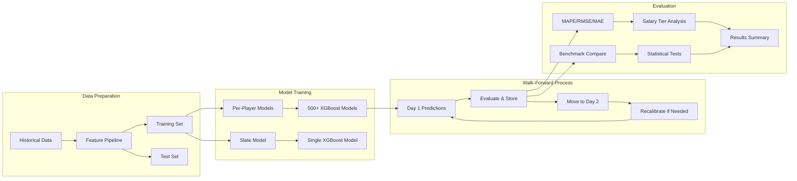

# Scripts Guide

Complete guide to all scripts in the `/scripts` directory, including usage instructions, command examples, and functionality descriptions.

## Backtest Workflow Architecture



## Table of Contents

1. [Data Collection Scripts](#data-collection-scripts)
   - [collect_games.py](#collect_gamespy)
   - [collect_dfs_salaries.py](#collect_dfs_salariespy)
   - [collect_depth_charts.py](#collect_depth_chartspy)
2. [Data Loading Scripts](#data-loading-scripts)
   - [load_games_to_db.py](#load_games_to_dbpy)
3. [Model Training and Evaluation](#model-training-and-evaluation)
   - [run_backtest.py](#run_backtestpy)
   - [evaluate_with_benchmark.py](#evaluate_with_benchmarkpy)
   - [optimize_xgboost_hyperparameters.py](#optimize_xgboost_hyperparameterspy)

---

## Data Collection Scripts

### collect_games.py

Collects historical NBA game data including schedules and box scores.

#### Functionality
- Phase 1: Collects daily schedules from Tank01 API
- Phase 2: Collects box scores for each game
- Saves data as Parquet files for efficient storage
- Handles errors gracefully and provides progress updates

#### Prerequisites
- TANK01_API_KEY in .env file
- RapidAPI subscription to Tank01 Fantasy Stats API
- Free tier: 1000 requests/month

#### Usage

```bash
python scripts/collect_games.py --start-date YYYYMMDD --end-date YYYYMMDD
```

#### Arguments

**Required:**
- `--start-date`: First date to collect (format: YYYYMMDD)
- `--end-date`: Last date to collect (format: YYYYMMDD)

**Optional:**
- `--yes`, `-y`: Skip confirmation prompt

#### Examples

```bash
# Collect one month of data
python scripts/collect_games.py --start-date 20241201 --end-date 20241231

# Collect with auto-confirm (for automation)
python scripts/collect_games.py --start-date 20241201 --end-date 20241231 -y
```

#### Output Files
- `data/inputs/schedule/schedule_YYYYMMDD.parquet` - Daily schedules
- `data/inputs/box_scores/box_scores_GAMEID.parquet` - Game box scores

#### API Usage Estimation
- 1 week (7 days): ~84 requests
- 1 month (30 days): ~360 requests
- 1 season (180 days): ~2,160 requests

---

### collect_dfs_salaries.py

Collects DFS salary data from Tank01 API for specified date range.

#### Functionality
- Retrieves daily DFS salaries for all players
- Supports multiple DFS platforms (DraftKings, FanDuel, etc.)
- Stores data as Parquet files with date partitioning

#### Prerequisites
- TANK01_API_KEY in .env file
- RapidAPI subscription to Tank01 Fantasy Stats API

#### Usage

```bash
python scripts/collect_dfs_salaries.py --start-date YYYYMMDD --end-date YYYYMMDD
```

#### Arguments

**Required:**
- `--start-date`: First date to collect (format: YYYYMMDD)
- `--end-date`: Last date to collect (format: YYYYMMDD)

**Optional:**
- `--platform`: DFS platform (default: DraftKings)
- `--yes`, `-y`: Skip confirmation prompt

#### Examples

```bash
# Collect DraftKings salaries for December 2024
python scripts/collect_dfs_salaries.py --start-date 20241201 --end-date 20241231

# Collect FanDuel salaries
python scripts/collect_dfs_salaries.py --start-date 20241201 --end-date 20241231 --platform FanDuel

# Auto-confirm for automation
python scripts/collect_dfs_salaries.py --start-date 20241201 --end-date 20241231 -y
```

#### Output Files
- `data/inputs/dfs_salaries/dfs_salaries_YYYYMMDD.parquet` - Daily salary data

#### Data Included
- playerID, longName, team, teamID
- pos (position), allValidPositions
- salary, platform

---

### collect_depth_charts.py

Collects NBA team depth charts showing player rotation priorities.

#### Functionality
- Retrieves depth charts for all teams or specific team
- Shows rotation order by position (1=starter, 2=backup, etc.)
- Supports both Parquet and SQLite storage
- Useful for injury impact analysis and playing time projection

#### Prerequisites
- TANK01_API_KEY in .env file
- RapidAPI subscription to Tank01 Fantasy Stats API

#### Usage

```bash
# Collect all teams
python scripts/collect_depth_charts.py --all-teams

# Collect specific team
python scripts/collect_depth_charts.py --team LAL
```

#### Arguments

**Optional:**
- `--team`: Team abbreviation (e.g., LAL, BOS, GSW)
- `--all-teams`: Collect all teams (default if no team specified)
- `--storage`: Storage type - 'parquet' (default) or 'sqlite'
- `--db-path`: SQLite database path (default: nba_dfs.db)
- `--verbose`: Enable verbose output

#### Examples

```bash
# Collect all teams to Parquet with verbose output
python scripts/collect_depth_charts.py --all-teams --verbose

# Collect Lakers depth chart to SQLite
python scripts/collect_depth_charts.py --team LAL --storage sqlite

# Collect all teams to custom database
python scripts/collect_depth_charts.py --all-teams --storage sqlite --db-path custom.db
```

#### Output Files
- **Parquet:** `data/inputs/depth_charts/depth_charts_YYYYMMDD.parquet`
- **SQLite:** depth_charts table in specified database

#### Data Included
- team, position, depth_order
- playerID, playerName
- collection_date

#### Use Cases
- Playing time projection for starters vs backups
- Injury impact analysis (who benefits when player is out)
- DFS value identification based on rotation changes
- Usage rate and shot attempt predictions

---

## Data Loading Scripts

### load_games_to_db.py

Loads collected game data from Parquet files into SQLite database.

#### Functionality
- Reads Parquet files from data/inputs/
- Transforms data for database schema
- Loads into SQLite database (nba_dfs.db)
- Creates tables: player_logs, games, dfs_salaries, injuries, seasons
- Provides legacy compatibility and SQL-based analysis

#### Prerequisites
- Parquet files collected via collect_games.py and collect_dfs_salaries.py
- Sufficient disk space for SQLite database

#### Usage

```bash
python scripts/load_games_to_db.py
```

#### Arguments

None - uses default paths and database location.

#### Examples

```bash
# Load all collected data to database
python scripts/load_games_to_db.py
```

#### Output
- Creates/updates `nba_dfs.db` SQLite database in project root
- Tables: player_logs, games, dfs_salaries, injuries, seasons

#### Notes
- Parquet files remain the primary data source
- SQLite database is for legacy compatibility
- Useful for SQL-based exploratory analysis
- Can be queried with any SQLite client

---

## Model Training and Evaluation

### run_backtest.py

Run walk-forward backtest with per-player or slate-level models.

#### Functionality
- Walk-forward validation across multiple slates
- Per-player or slate-level XGBoost models
- Benchmark comparison with season averages
- Statistical significance testing (paired t-test, Cohen's d)
- Salary tier performance analysis
- Model and prediction persistence
- Comprehensive logging and reporting

#### Prerequisites
- SQLite database with historical data (see collect_games.py)
- Feature configuration YAML (see config/features/)
- Sufficient disk space for model saving (optional)

#### Usage

```bash
python scripts/run_backtest.py --test-start YYYYMMDD --test-end YYYYMMDD
```

#### Arguments

**Required:**
- `--test-start`: Test start date (format: YYYYMMDD)
- `--test-end`: Test end date (format: YYYYMMDD)

**Optional:**
- `--db-path`: Path to SQLite database (default: nba_dfs.db)
- `--num-seasons`: Number of seasons for training (default: 1)
- `--model-type`: Model type - xgboost, random_forest, or linear (default: xgboost)
- `--feature-config`: Feature configuration name (default: default_features)
- `--per-player`: Use per-player models instead of slate-level
- `--min-player-games`: Minimum games for per-player models (default: 10)
- `--min-benchmark-games`: Minimum games for benchmark (default: 5)
- `--recalibrate-days`: Recalibrate model every N days (default: 7)
- `--output-dir`: Output directory (default: data/backtest_results)
- `--no-save-models`: Do not save trained models
- `--no-save-predictions`: Do not save predictions to parquet
- `--max-depth`: XGBoost max_depth (default: 6)
- `--learning-rate`: XGBoost learning_rate (default: 0.05)
- `--n-estimators`: XGBoost n_estimators (default: 200)
- `--verbose`: Enable verbose logging

#### Examples

```bash
# Single day backtest
python scripts/run_backtest.py --test-start 20250205 --test-end 20250205

# One week with per-player models
python scripts/run_backtest.py --test-start 20250201 --test-end 20250207 --per-player

# Full month with custom features
python scripts/run_backtest.py --test-start 20250201 --test-end 20250228 --feature-config base_features

# Season backtest with model saving disabled
python scripts/run_backtest.py --test-start 20250101 --test-end 20250228 --no-save-models

# Verbose logging for debugging
python scripts/run_backtest.py --test-start 20250205 --test-end 20250206 --verbose

# Custom hyperparameters
python scripts/run_backtest.py --test-start 20250201 --test-end 20250228 \
  --max-depth 8 --learning-rate 0.03 --n-estimators 300
```

#### Output Files

**Daily Results (output-dir):**
- `backtest_results_START_to_END.csv` - Per-slate metrics
- `summary_START_to_END.txt` - Overall summary with statistical tests
- `tier_comparison_START_to_END.csv` - Performance by salary tier

**Predictions (if save_predictions=True):**
- `data/models/per_slate/YYYYMMDD.parquet` - Predictions for each date
- `data/models/per_slate/YYYYMMDD_with_actuals.parquet` - Predictions with actual results

**Models (if save_models=True):**
- Per-player: `data/models/per_player/PLAYERID_NAME.pkl`
- Slate-level: `data/models/per_slate/MODEL_DATE.pkl`
- Metadata: Corresponding `.json` files with training info

#### Metrics Reported

**Model Performance:**
- MAPE (Mean Absolute Percentage Error)
- RMSE (Root Mean Squared Error)
- MAE (Mean Absolute Error)
- Correlation coefficient

**Benchmark Comparison:**
- Benchmark MAPE/RMSE
- MAPE improvement (model vs benchmark)
- Statistical significance (p-value, t-statistic)
- Effect size (Cohen's d)

**Salary Tier Analysis:**
- Performance breakdown by salary tier (Low/Mid/High/Elite)
- Model vs benchmark for each tier

#### Training Period Calculation

Training period is automatically calculated:
- `num_seasons=1`: Current season start to day before test start
- `num_seasons=2`: Previous season start to day before test start

Example:
```bash
--test-start 20250205 --num-seasons 1
# Training: 20241001 to 20250204 (current season)

--test-start 20250205 --num-seasons 2
# Training: 20231001 to 20250204 (includes previous season)
```

#### Performance Considerations
- Per-player models: 500+ models per slate, slower but more accurate
- Slate-level models: Single model, faster, good baseline
- Model recalibration: Lower recalibrate-days = more accurate but slower
- Prediction saving: Adds I/O overhead but enables analysis

---

### evaluate_with_benchmark.py

Evaluate model predictions against season average benchmark for a specific date.

#### Functionality
- Trains models (per-player or slate-level) for single date
- Generates predictions with benchmark comparison
- Head-to-head model vs benchmark analysis
- Salary tier performance breakdown
- Detailed comparison reports

#### Prerequisites
- SQLite database with historical data
- Feature configuration YAML

#### Usage

```bash
python scripts/evaluate_with_benchmark.py --date YYYYMMDD --model-type per-player
```

#### Arguments

**Required:**
- `--date`: Prediction date (format: YYYYMMDD)

**Optional:**
- `--model-type`: Model type - per-player or slate (default: per-player)
- `--lookback-days`: Days of historical data for per-player models (default: 365)
- `--train-days`: Days of training data for slate model (default: 90)
- `--min-games`: Minimum games for per-player model (default: 10)
- `--feature-config`: Feature configuration name (default: default_features)
- `--export-results`: Export detailed results to CSV
- `--output-dir`: Output directory (default: outputs/benchmark_comparison)

#### Examples

```bash
# Per-player model evaluation
python scripts/evaluate_with_benchmark.py --date 20250115 --model-type per-player

# Slate model evaluation with custom training window
python scripts/evaluate_with_benchmark.py --date 20250115 --model-type slate --train-days 90

# Export results to CSV
python scripts/evaluate_with_benchmark.py --date 20250115 --export-results

# Custom feature configuration
python scripts/evaluate_with_benchmark.py --date 20250115 --feature-config base_features
```

#### Output Files

**Console Output:**
- Benchmark comparison summary
- Performance by salary tier
- Detailed metrics for model and benchmark

**Exported Files (if --export-results):**
- `benchmark_comparison_MODELTYPE_DATE.csv` - Detailed results
- `tier_comparison_MODELTYPE_DATE.csv` - Salary tier breakdown
- `summary_MODELTYPE_DATE.json` - Summary metrics

#### Use Cases
- Quick single-date model validation
- Benchmark comparison for specific slate
- Feature configuration testing
- Model type comparison (per-player vs slate)

---

### optimize_xgboost_hyperparameters.py

Bayesian hyperparameter optimization for XGBoost models using Optuna.

#### Functionality
- Bayesian optimization for hyperparameter search
- Cross-validation for robust evaluation
- Per-player or slate-level optimization
- Automatic best parameter selection
- Results saved to JSON for reproducibility

#### Prerequisites
- SQLite database with historical data
- Feature configuration YAML
- Optuna library installed

#### Usage

```bash
python scripts/optimize_xgboost_hyperparameters.py
```

#### Arguments

**Optional:**
- `--feature-config`: Feature configuration to use (default: default_features)
- `--per-player`: Run per-player optimization (default: slate-level)
- `--n-trials`: Number of optimization trials (default: 30)
- `--cv-folds`: Cross-validation folds (default: 3)

#### Examples

```bash
# Slate-level optimization with default settings
python scripts/optimize_xgboost_hyperparameters.py

# More thorough optimization with 50 trials
python scripts/optimize_xgboost_hyperparameters.py --n-trials 50

# Per-player optimization
python scripts/optimize_xgboost_hyperparameters.py --per-player --feature-config base_features

# Quick test with minimal features
python scripts/optimize_xgboost_hyperparameters.py --feature-config base_features --n-trials 10
```

#### Output Files
- `optimization_results.json` - Best hyperparameters and scores
  - best_params: Optimal hyperparameter values
  - best_score: Best MAE achieved
  - n_trials: Number of trials run
  - feature_config: Configuration used
  - timestamp: When optimization was run

#### Hyperparameters Optimized
- max_depth: Tree depth (3-10)
- learning_rate: Step size (0.01-0.3)
- n_estimators: Number of trees (100-500)
- subsample: Row sampling ratio (0.6-1.0)
- colsample_bytree: Column sampling ratio (0.6-1.0)
- min_child_weight: Minimum sum of instance weight (1-10)
- gamma: Minimum loss reduction (0-1)

#### Optimization Process
1. Loads historical data
2. Builds features using specified config
3. Runs Bayesian optimization with Optuna
4. Evaluates each trial with cross-validation
5. Selects best parameters based on MAE
6. Saves results to JSON file

#### Performance Notes
- Slate-level: Faster, good for initial exploration
- Per-player: Slower but provides per-player optimal params
- More trials = better results but longer runtime
- Use fewer CV folds for faster iteration

---

## Common Workflows

### Initial Setup

1. Collect historical data:
```bash
python scripts/collect_games.py --start-date 20241001 --end-date 20241231
python scripts/collect_dfs_salaries.py --start-date 20241001 --end-date 20241231
```

2. Load to database (optional):
```bash
python scripts/load_games_to_db.py
```

### Model Development

1. Optimize hyperparameters:
```bash
python scripts/optimize_xgboost_hyperparameters.py --n-trials 50
```

2. Run backtest:
```bash
python scripts/run_backtest.py --test-start 20250101 --test-end 20250131
```

3. Evaluate specific date:
```bash
python scripts/evaluate_with_benchmark.py --date 20250115 --export-results
```

### Production Inference

1. Collect latest data:
```bash
python scripts/collect_games.py --start-date 20250201 --end-date 20250201
python scripts/collect_dfs_salaries.py --start-date 20250201 --end-date 20250201
```

2. Update depth charts:
```bash
python scripts/collect_depth_charts.py --all-teams
```

3. Generate predictions (use trained models from backtest)

---

## Troubleshooting

### API Rate Limits
- Free tier: 1000 requests/month
- Check remaining requests: Monitor console output
- Solution: Collect data in smaller batches

### Missing Data
- Check API response status codes
- Verify date formats (YYYYMMDD)
- Ensure TANK01_API_KEY is set in .env

### Memory Issues
- Per-player models use more memory
- Solution: Use `--no-save-models` flag
- Solution: Process smaller date ranges

### Slow Performance
- Per-player models are slower
- Solution: Use slate-level for quick iteration
- Solution: Increase `--recalibrate-days`

---

## Best Practices

1. **Data Collection**: Start with 1-2 weeks for testing before full season
2. **Backtesting**: Use `--verbose` flag during development for debugging
3. **Model Saving**: Disable with `--no-save-models` during experimentation
4. **Feature Testing**: Use `base_features` config for faster iteration
5. **Automation**: Use `-y` flag to skip confirmation prompts
6. **Version Control**: Keep optimization_results.json in version control

---

## Support

For issues or questions:
1. Check error messages in console output
2. Enable `--verbose` logging for detailed information
3. Review [scripts/README.md](../scripts/README.md) for additional details
4. Check [CLAUDE.md](../CLAUDE.md) for architecture overview
