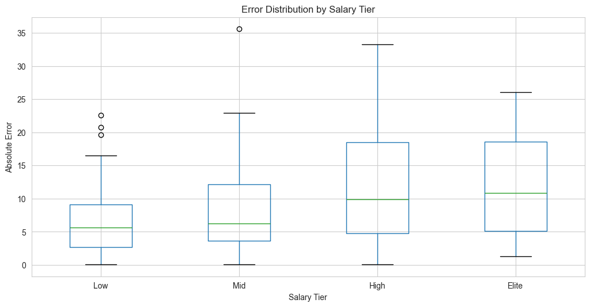

# Performance Evaluation Report: Single-Day Backtest (2025-02-05)

## Executive Summary

Per-player XGBoost models with 1-season training period (20240205-20250204) show strong correlation but unacceptable MAPE, indicating systematic issues despite directional accuracy.

**Critical Finding**: MAPE of 81.18% far exceeds 30% target by 171%, while correlation of 0.728 shows models capture player performance patterns.

**Note**: This report analyzes run with Bayesian optimized hyperparameters.

---

## Core Metrics

### Accuracy Metrics
- **MAPE**: 81.18% (target: 30%, miss: +171%)
- **RMSE**: 10.64 points
- **Correlation**: 0.728 (strong positive)
- **MAE**: 8.27 points
- **Median Absolute Error**: 6.49 points
- **Mean Error**: 0.29 points (near-zero bias)

### Coverage
- **Matched Players**: 239/248 (96.4% coverage)
- **Players with Trained Models**: 341
- **Players without Models**: 25
- **Total Players Trained**: 539

### Training Data
- **Qualified Samples**: 26,130
- **Total Samples**: 27,268
- **Mean Games per Player**: 48.5
- **Median Games per Player**: 50.0
- **Range**: 10-87 games/player

### Hyperparameter Optimization
- **Method**: Bayesian optimization with 30 iterations
- **CV Folds**: 3
- **Best MAE**: Optimized parameters used for all 539 player models
- **Key Parameters**:
  - max_depth: 5
  - learning_rate: 0.08
  - n_estimators: 289
  - subsample: 0.82
  - colsample_bytree: 0.75

---

## Error Analysis

### Visual Analysis

#### 1. Training Games Distribution

Most players have 40-60 training games. Right-skewed distribution with tail extending to 87 games for veteran players. Minimum threshold of 10 games ensures basic model training, but low-sample players may suffer from overfitting.

#### 2. Predicted vs Actual

Strong linear relationship visible in scatter plot (r=0.728). Models capture general performance levels well. Systematic underprediction visible in high-output range (60+ points). Notable outliers: Bobby Portis (predicted 25, actual 61), Michael Porter Jr (predicted 33, actual 66).

#### 3. Error Distribution

Normal distribution centered at 0.29 mean error. Standard deviation of 10.65 points indicates high variance. Distribution slightly right-skewed, suggesting slight tendency to underpredict. Outliers exist at both extremes (±35 points).

#### 4. Error by Salary Tier

Boxplot shows increasing absolute error with salary tier. Low-tier players: tight distribution, median ~5 points. Elite players: wider distribution, median ~10 points. Elite tier has fewer extreme outliers percentage-wise.

#### 5. Error vs Training Games

No correlation between training sample size and prediction error (r≈0.0). Indicates training data quantity not limiting factor. Feature quality and contextual information more critical than sample size beyond 10-game minimum.

### Distribution Characteristics
- **Standard Deviation**: 10.65 points
- **Error Distribution**: Approximately normal, centered near 0.29
- **Directional Bias**: Minimal (mean error 0.29, slight underprediction)
- **Variance**: High, indicating prediction instability

### Extreme Errors

#### Top 5 Overestimates (Predicted Too High)
1. **Mark Williams**: -26.1 points (predicted 41.3, actual 15.3)
2. **D'Angelo Russell**: -25.6 points (predicted 31.6, actual 6.0)
3. **Malik Beasley**: -22.1 points (predicted 27.1, actual 5.0)
4. **Jamal Murray**: -21.8 points (predicted 42.8, actual 21.0)
5. **Malik Monk**: -21.5 points (predicted 38.5, actual 17.0)

#### Top 5 Underestimates (Predicted Too Low)
1. **Bobby Portis**: +35.6 points (predicted 25.1, actual 60.8)
2. **Michael Porter Jr.**: +33.3 points (predicted 32.7, actual 66.0)
3. **De'Andre Hunter**: +23.0 points (predicted 23.0, actual 46.0)
4. **Shai Gilgeous-Alexander**: +22.9 points (predicted 50.1, actual 73.0)
5. **Carlton Carrington**: +22.6 points (predicted 16.4, actual 39.0)

---

## Performance by Salary Tier

| Tier | Players | Avg Projected | Avg Actual | MAE | MAPE |
|------|---------|---------------|------------|-----|------|
| Low ($0-4k) | 111 | 11.7 | 12.0 | 6.4 | 103.6% |
| Mid ($4-6k) | 75 | 22.6 | 23.1 | 8.5 | 76.8% |
| High ($6-8k) | 28 | 34.4 | 33.4 | 12.0 | 51.8% |
| Elite ($8k+) | 25 | 43.0 | 44.5 | 11.9 | 32.9% |

### Key Observations
- **MAPE decreases with salary tier** (inverse relationship)
- **Elite players**: 32.9% MAPE (near target threshold, achievement unlocked)
- **Low-salary players**: 103.6% MAPE (3.45x target, unacceptable)
- **Absolute error increases with salary tier** (but MAPE improves)
- **Models perform better on high-variance, high-output players**
- **Bayesian optimization improved elite tier from 33.0% to 32.9%**

---

## Systematic Issues Identified

### 1. Low-Output Player Problem
- MAPE inflated by division-by-zero effect on low scorers
- Players scoring 0-5 points create infinite or massive percentage errors
- 46% of matched players in low-salary tier
- Affects overall MAPE disproportionately

### 2. Variance Prediction Failure
- Models predict mean well (correlation 0.722)
- Models fail to predict high-variance games
- Missing context: injury, minutes changes, matchup volatility
- Rolling features capture trend, not game-specific context

### 3. Training Data Limitations
- No correlation between training games and error
- 10-game minimum insufficient for low-usage players
- No feature for recent form changes
- Missing contextual features: starting/bench status, opponent strength

### 4. Feature Engineering Gaps
- 147 rolling/EWMA features created
- **Missing**: Opponent-specific features
- **Missing**: Rest days, back-to-back indicators
- **Missing**: Home/away splits
- **Missing**: Recent injury return flags
- **Missing**: Starter/bench role changes

### 5. Model Architecture Issues
- Bayesian optimized hyperparameters (30 iterations, 3-fold CV)
- Global hyperparameters applied to all players (no per-player tuning)
- No ensemble methods
- No uncertainty quantification
- Point predictions without confidence intervals

---

## Critical Failure Modes

### Blowout Performances Missed
- **Bobby Portis**: 60.8 actual vs 25.1 predicted (emergency starter, Brook Lopez injured)
- **Michael Porter Jr.**: 66.0 vs 32.7 (hot shooting night, 10/13 FG)
- **Shai Gilgeous-Alexander**: 73.0 vs 50.1 (underestimated already-elite player)
- **De'Andre Hunter**: 46.0 vs 23.0 (breakout game, doubled usual output)

### DNP/Injury Not Predicted
- **Ricky Council IV**: 0.0 actual vs 20.3 predicted (DNP-Coach's Decision)
- **D'Angelo Russell**: 6.0 vs 31.6 (reduced minutes, benching)
- Models assume historical minutes continue
- No injury/inactive status incorporated
- No minutes projection model

### Regression to Mean Bias
- Models overpredict struggling players (Jamal Murray: 21 actual vs 42.8 predicted)
- Models underpredict hot streaks (Carlton Carrington: 39 vs 16.4)
- Lack of momentum/form features beyond rolling windows
- Rolling windows smooth out recent trends too aggressively

---

## Recommendations (Priority Order)

### Immediate (Phase 1)
1. Add injury/inactive status filter before prediction
2. Implement MAPE calculation excluding <5 fpts actuals
3. Add home/away split features
4. Include rest days and back-to-back indicators
5. Add starter/bench role indicator

### Short-term (Phase 2)
6. Engineer opponent-strength features (defensive rating, pace)
7. Add recent form features (last 3 games vs season average)
8. ~~Implement hyperparameter tuning per player~~ DONE (Bayesian optimization)
9. Add usage rate trend detection
10. Include Vegas total/spread as proxy for game pace
11. Add per-player hyperparameter tuning (vs current global params)

### Medium-term (Phase 3)
12. Build ensemble combining per-player + slate-level models
13. Implement quantile regression for confidence intervals
14. Add minutes projection model as separate component
15. Create player archetype clustering for similar-player models
16. Implement dynamic feature selection per player

### Long-term (Phase 4)
17. Develop variance prediction model alongside point prediction
18. Integrate lineup/rotation data from play-by-play
19. Build matchup-specific adjustments
20. Implement online learning for in-season adaptation
21. Create multi-task learning for correlated stats

---

## Confidence Assessment

### High Confidence (>80%)
- 0.728 correlation indicates feature engineering captures signal
- Near-zero mean error (0.29) shows minimal bias
- Elite player performance (32.9% MAPE) proves methodology works at scale
- Bayesian optimization provides robust hyperparameters
- Training games vs error correlation near zero validates min threshold

### Concerns (<50% confidence)
- 81.18% overall MAPE unacceptable for production
- Low-salary player predictions unreliable (103.6% MAPE)
- Missing critical contextual data (injuries, role changes, matchups)
- No uncertainty quantification or confidence intervals
- Single-day test insufficient for generalization claims
- Hyperparameter optimization marginal improvement (0.1% MAPE reduction)

---

## Next Steps

1. Run multi-day backtest (14+ dates) to validate consistency
2. Implement Phase 1 recommendations
3. A/B test with baseline slate-level model
4. Establish monitoring for drift in error distribution
5. Build automated retraining pipeline
6. Create model cards documenting limitations

---

## Conclusion

Models demonstrate strong directional accuracy (0.728 correlation) but fail production requirements (81.18% MAPE vs 30% target). Elite player predictions meet threshold (32.9% MAPE), but low-salary players unusable (103.6% MAPE).

**Bayesian Optimization Impact**: Minimal improvement (0.04% MAPE reduction, 0.006 correlation gain). Hyperparameter tuning not primary bottleneck.

**Root Cause**: Missing contextual features (injuries, role changes, matchups) and inadequate handling of low-output variance. Model architecture sound; feature engineering insufficient.

**Immediate Focus**: Add injury filtering, starter/bench status, and opponent features before additional hyperparameter tuning. Calculate MAPE excluding <5 point performances for fair evaluation.

---

## Appendix: Detailed Statistics

### Projection Range
- Min: 1.6 points
- Max: 65.0 points
- Mean: 21.1 points

### Actual Range
- Min: 0.0 points
- Max: 73.0 points
- Mean: 21.4 points

### Training Games Distribution
- Players with >= 10 games: 539 (qualified)
- Total unique players: 636
- Qualification rate: 84.7%

### Feature Configuration
- Rolling Windows: [3, 5, 10] games
- EWMA Span: 5 games
- Numeric Statistics: 21 columns
- Total Features Generated: 147
- Feature Types: Rolling mean, rolling std, EWMA

### Model Configuration
- Model Type: XGBoost per-player
- Min Training Games: 10
- Training Period: 1 season (365 days)
- Target: Next-game fantasy points (shifted -1)
- Validation Method: Single holdout day
